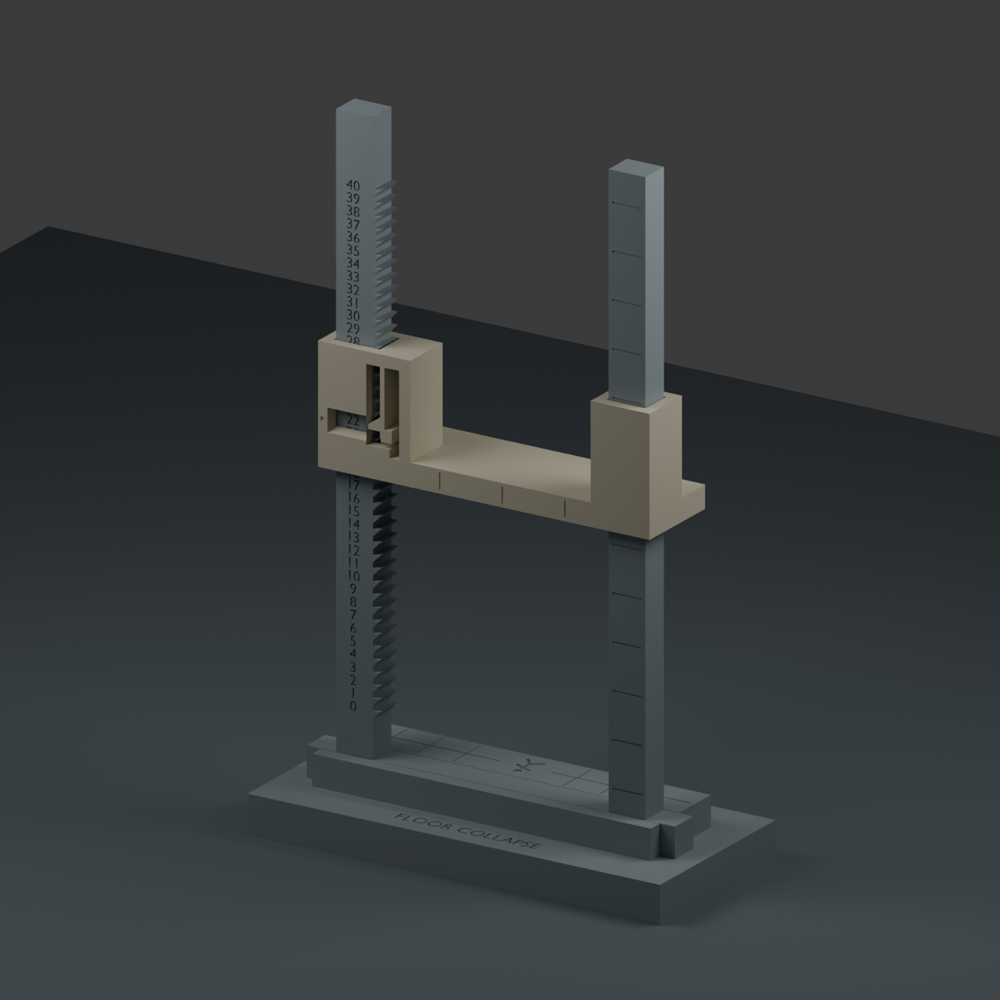

# Descending-ceiling floor timer — prototype v1

A three-part tabletop timer for **0–40 rounds**. The ceiling descends 3.2 mm per
round, and the current number appears in a window on its left collar. A release
tab disengages a positive shelf catch. The scale has **no special colors,
five-round zone, boss rule, or floor-specific behavior**. Set it to any starting
number up to 40. At zero the ceiling rests on the dungeon floor, covering the
tiny engraved crawler.

This is a **physically untested prototype**. Geometry checks and A1 mini slicing
passed; printed fit, release force, spring life and resistance to bumps still
need testing. There is no metal spring, screw, magnet or loose counter.

## What to print

All supplied 3MFs are **model-only files with millimetre dimensions and arranged
parts**. Import as geometry in Bambu Studio, select your own A1 mini and actual
filament, and use the settings below. They do not embed a printer/filament
profile or executable G-code.

Recommended sequence:

1. **00-small-latch-test.3mf** — a short rack and a cut-down catch, using the exact
   spring, latch and left guide geometry of the full timer. About **50 minutes /
   11.2 g PLA**. This checks the catch before committing to larger parts.
2. **02-full-frame.3mf** — the one-piece 0–40 frame. About **84 minutes / 25.7 g**.
3. **03-base-and-ceiling.3mf** — the two other final parts. About **145 minutes /
   53.1 g**. Together with the full frame, the timer is about **3 h 49 min / 79 g**.

An optional alternative is **01-test-and-reusable-parts.3mf**. This has a short
two-pillar 0–4 frame plus the full ceiling and base. It checks both guides and
the base connection, using about **178 minutes / 65.7 g**. If it works well,
print only `02-full-frame.3mf` afterward and reuse its ceiling and base. **Do not
also print `03-base-and-ceiling.3mf` unless you want duplicates.** The 0–4 labels
are simply a short test range, not a five-round game mechanic.

Times and masses are estimates from local Bambu Studio slicing with the PLA
settings below. Extra printer preparation and your own filament/profile may
change them. Individual STL files are in `stl/`; editable source is included.

## A1 mini fit

Every individual part and every supplied plate fits inside **180 × 180 × 180 mm**.

| Final part | Dimensions in supplied print orientation |
|---|---|
| One-piece frame | **100 × 174 × 8 mm** |
| Moving ceiling, including release spring | **90 × 31 × 24 mm** |
| Base | **112 × 50 × 18 mm** |

The full frame lies flat; it is not printed as two standing towers. Its long
dimension occupies 174 mm, leaving **3 mm at each end** on the arranged plate.
Do not add a wide brim or scale it to fit. The assembled base footprint is
112 × 50 mm, and maximum assembled height is about 177 mm at round 40.

The short two-pillar test frame prints at 100 × 64 × 8 mm. The smallest test
pieces are 20 × 56 × 8 mm and 25.5 × 31 × 24 mm.

## Starting print settings

| Setting | Value used for verification |
|---|---|
| Printer / nozzle | Bambu A1 mini / 0.4 mm |
| Filament | Plain PLA; actual profile should match your filament |
| Layer height / first layer | 0.16 mm / 0.20 mm |
| Walls / infill | 3 walls / 20% |
| Wall generator | Arachne |
| Supports | **Off** |
| Brim | **Off** |
| Elephant-foot compensation | 0.15 mm |
| Outer / inner wall speed | 50 / 80 mm/s |
| First-layer speed | 25 mm/s |
| Units / scale | Millimetres / 100% |

Keep the supplied orientations. The frame prints on its back with its numbers
up. The ceiling prints on its front face so the flexible arm lies in the print
bed plane. The base prints on its underside. The ceiling's guide openings
contain short bridges; remove any strings or sagged material that obstructs
them before testing. Do not fill the guide openings with supports.

The design can be printed entirely in one color. The sandstone-colored ceiling
in the preview is only to distinguish the moving part; it has no game meaning.
If desired, use different filament for that part or fill the engraved numbers
with a fine paint marker. Keep paint out of the sliding bores and latch faces.

If you change material, rerun the small test. PETG may be worth trying for the
spring after the initial PLA test, but this design's durability has not been
established in either material. Use your filament's normal temperature/cooling
profile. Do not globally scale a part to tune its fit.

## Small-test procedure

1. Clean the rack, spring gap and sliding bore. The spring is the narrow vertical
   arm next to the number window; it must be separate from the surrounding wall.
2. Face the rack's numbers toward you. Its teeth point to your right. Feed the
   cut-down catch over the top, with its number window toward you and release
   arm on your right.
3. Hold the catch, press its small lower tab **to the right, toward the adjacent
   rigid post**, and move it to a numbered position. Release the tab and gently
   lower the catch until the hook sits on a tooth shelf. The selected number
   should be centered in the window.
4. Hold the rack upright and verify that the released hook supports the catch.
   Then press the tab and move down one position. Repeat through 0–4. The catch
   should hold without continuing to press, and slide when deliberately released.
5. Stop if the spring whitens, cracks, fails to return, or needs excessive force.
   Binding with the tab held indicates a guide/print-fit issue, rather than a
   need to push harder on the latch. The adjacent rigid post limits nominal tab
   travel to about 2 mm; do not pry past it.

The small coupon tests only the left guide and release mechanism. The optional
two-pillar test also checks parallel guide fit and the base joint. Neither
coupon establishes long-term spring life or full-height stability.

## Full assembly and use

1. Insert the frame's lower tongue into the stepped slot in the base. The
   frame's lower crossbar seats level with the raised floor. The scale faces the
   front label, `FLOOR COLLAPSE`. The broad base keeps the upright frame stable.
2. Align both ceiling bores with the pillar tops. The number window faces front,
   above the numbered pillar. Hold the release tab in and slide the ceiling
   down over both pillars. Keep it level to avoid binding.
3. Set the ceiling to **22** for your first floor. Release the tab and settle the
   hook onto its shelf. Read the number **inside the window**, not the closest
   number above or below the collar.
4. Each round, **support the ceiling, press the release tab, lower it one number,
   release, and let the hook seat**. The 3.2 mm spacing is one round. Do not push
   the ceiling downward against an engaged catch.
5. To jump to any other number or reset a floor, support the ceiling and hold
   the release while sliding it to that position. There is no special action
   associated with 5. At zero, the floor provides the mechanical lower stop.

This is a manually positioned release latch, not an automatic one-step escapement.
**Holding the release can allow travel through multiple numbers**, so keep hold
of the ceiling while moving it. The frame is open at the top for assembly and
removal; the ceiling is retained by its collars throughout the numbered range.

No adhesive is required by the model. The base joint uses nominal clearance
rather than a snap lock: hold the frame while resetting if it lifts from its
socket. If the printed joint is loose, a thin paper/tape shim is reversible;
if tight, inspect first-layer flare and clean it before forcing the tongue.

## What was checked

- All six STLs have positive volume, one connected solid, and zero nonmanifold
  edges.
- All 41 resting positions clear the stationary frame geometrically.
- At every nonzero position, a small downward move without release intersects
  the tooth shelf, confirming a geometric interlock rather than friction-only
  retention.
- A 21-position check across a repeating pitch clears the frame with an
  approximate inward-bent release arm.
- The frame fits its base socket without geometric interference; at zero the
  ceiling contacts the floor without penetrating it.
- All four supplied plates fit the A1 mini volume and slice successfully at
  0.16 mm with **no warnings and supports disabled**.

The released-arm shape is a geometric approximation, not a finite-element,
force, fatigue, impact or stability simulation. Real print tolerances, spring
force/life, grip, and guide bridge quality remain to be verified physically.
Reports are in `validation/geometry.json` and `validation/slicing-summary.json`.
No job has been sent to a printer.

## Editable source and future capacity

`collapse-timer.blend` includes the manufacturing meshes, print-oriented copies,
and the actual assembled preview. `build.py` regenerates the files using
Blender's Python; `validate_slicing.py` uses locally installed Bambu profiles to
check the plates, then removes generated G-code. Neither script contacts a
printer. Dimensions are millimetres.

The initial design supports 40 rounds. Longer floors within that limit need
only a different starting position. Increasing capacity beyond 40 needs a
dimension/layout revision; simply lengthening this 174 mm frame would consume
the A1 mini's remaining bed space. A split frame or revised spacing is a future
option, not part of this prototype.
