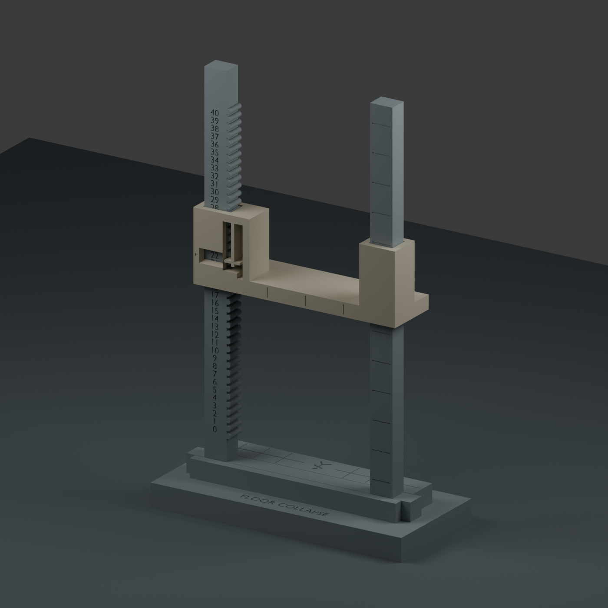

# Descending ceiling — push-to-click version 2

Move the ceiling **up or down by pushing or pulling it**. Rounded crests on the
numbered pillar deflect a rounded spring follower, which settles into the next
valley. There is no release tab to operate. The old version used locking shelves
and required a separate release; it should not be forced down in this way.

The size, 0–40 scale, three-part assembly and neutral colors are retained. The
base is compatible with V1. **Use the V2 frame and V2 ceiling together**; neither
should be mixed with the old latch mechanism. All files in this folder/ZIP are V2.

This is still a **physically untested prototype**. The intended tactile click,
audible sound, holding strength and spring life must be judged from a real
print. Geometry and slicing checks cannot prove those qualities.

## Print the click-feel test first

**00-click-feel-test.3mf** contains a short rack and two catch samples:

- **Standard:** 1.4 mm spring arm; this is the default in the full print plates.
- **Light:** 1.2 mm spring arm; an alternative if the standard feels too stiff.

Both have the same sliding-bore dimensions. The lighter arm changes the click,
not a binding guide fit. In the supplied layout the rack is on the left, the
standard sample is in the middle, and the light sample is on the right. The
object names identify them in Bambu Studio; mark their undersides after printing
so they don't get mixed up.

1. Clear any strings, first-layer flare or rough bridge material from the bore
   and spring gap. The arm must be free of the surrounding body.
2. With the numbers facing you, slide one sample over the top of the short rack.
   Its window faces you and the spring is on the right. The smooth lead-in
   precedes the first crest; continue with controlled pressure to engage it.
3. Hold the rack and push/pull the sample through 0–4. It should settle at the
   numbers and require renewed pressure to move to the next one. Try both arms.
   Do not pull the spring aside or pry on its small internal travel stop.
4. A small coupon is lighter than the complete ceiling. It tests fit and feel,
   **not** the full roof's ability to stay parked. After assembling the full
   timer, check that the ceiling holds its weight at low, middle and high
   positions and through ordinary table handling. Start with the standard arm.
5. If the ceiling drifts or runs through multiple positions under its own weight,
   don't print a batch: that result calls for further spring/cam tuning. If it
   binds or the spring whitens or cracks, stop forcing it and inspect the fit.

The exact mass/time estimates for each plate are saved in
`validation/slicing-summary.json`.

## Print the full timer

The normal two-plate set is:

1. **02-full-frame.3mf** — one V2 frame, printed flat.
2. **03-base-and-ceiling.3mf** — the compatible base and a standard V2 ceiling.

If you already printed the V1 base, reuse it and omit `base` from the second
plate. If you prefer the light spring after testing, substitute
`stl/ceiling-click-light.stl` for the standard ceiling in the slicer. The STL is
already oriented for printing; keep it at 100% in millimetres.

**01-test-and-reusable-parts.3mf** is optional: a short two-pillar frame plus the
full base and standard ceiling, to check both guides under the full ceiling's
weight. Its ceiling and base can be reused with `02-full-frame.3mf`. Do not also
print `03-base-and-ceiling.3mf` unless you want duplicates.

All 3MFs are model-only files with placed parts, not saved filament profiles or
executable print jobs. Select your A1 mini and actual filament in Bambu Studio.

| Setting | Verification starting point |
|---|---|
| Printer / nozzle | A1 mini / 0.4 mm |
| Material | Plain PLA with your filament's normal temperature and cooling |
| Layer height / first layer | 0.16 / 0.20 mm |
| Walls / infill | 3 / 20% |
| Wall generator | Arachne |
| Supports / brim | Off / off |
| Elephant-foot compensation | 0.15 mm |
| Outer / inner wall speed | 50 / 80 mm/s |
| First-layer speed | 25 mm/s |
| Scale | 100%, millimetres |

Keep the supplied orientations: frame on its back with numbers up; ceiling on
its front so the spring lies in the bed plane; base on its underside. The guide
bores have short bridges. Don't auto-orient the ceiling or add supports inside
its moving mechanism. Changing filament can change fit and click feel; retest
instead of scaling one part.

| Part | Printed dimensions |
|---|---|
| Full frame | 100 × 174 × 8 mm |
| Either full ceiling | 90 × 31 × 24 mm |
| Base | 112 × 50 × 18 mm |

These fit the A1 mini's 180 mm build volume. The arranged frame has 3 mm at each
end of its long dimension; leave its brim off. Maximum assembled height is
about 177 mm, on a 112 × 50 mm footprint. The colors in the render only distinguish
the parts; there are no special five-round markings or mechanics.

## Assembly and use

1. Seat the frame tongue in the base socket, with the scale facing the front
   label. The crossbar should sit level with the raised floor.
2. Feed the ceiling onto both pillar tops, with the window facing front over the
   numbered pillar. Keep it level and click down to your starting number.
3. **Steady the base/frame and grip the broad ceiling beam near the numbered
   pillar. Push down one click per round; pull up to reset.** Apply force to the
   ceiling body, not the exposed spring. A short nudge is easier to control than
   sustained pressure. The selected number is the one in the window.
4. Holding steady force can move through several clicks: this is a detent,
   not an automatic one-step dispenser. Moving upward also requires holding
   the base so the whole timer doesn't lift.
5. At zero the ceiling meets the floor and covers the engraved crawler. Reset
   to any number up to 40. The open pillar tops permit removal for servicing.

No screws or separate springs are used. The base remains a slip-fit joint. If
the printed socket is loose, a thin removable paper/tape shim can take up play.

## What is checked, and what isn't

The build verifies single connected, manifold solids; positive volumes; fit
inside the A1 mini; all 41 geometric resting positions; frame/base clearance;
and zero-position floor contact. The standard and light versions use the same
guide and follower locations.

The follower encounters a geometric obstacle halfway between numbers in either
direction when unflexed. A circular-cam calculation and an approximately bent
spring envelope check 65 positions across a full repeating pitch for each
variant. The estimated required lateral clearance travel stays below the
internal stop's 1.35 mm allowance. This verifies a clearance path, not real
force, stress, fatigue, sound or resistance to gravity and impacts.

The files are sliced locally using the A1 mini profiles. Exact checks and
results live in `validation/geometry.json` and `validation/slicing-summary.json`.
No print job has been sent to a printer.

`collapse-timer.blend` and `build.py` are the editable source. The source uses
millimetres and Blender's bundled Python without add-ons. `validate_slicing.py`
uses locally installed Bambu Studio profiles and removes generated G-code.
The previous locking-latch prototype remains separately in the parent folder.
