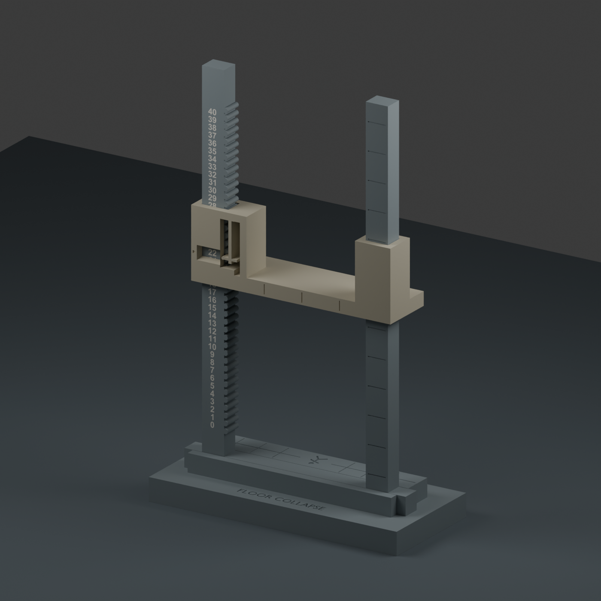

# Collapse tower V3 — flush two-color numbers and closer ceiling guides

The tower's numbers are now **contrasting filament inlays**, printed level
with the numbered post's front face. They fill shaped recesses 0.6 mm deep;
they do not project into the ceiling's sliding path. There is no separate
label strip to assemble or glue. Number height is 2.5 mm in a bold font.

The ceiling guides now have **0.20 mm clearance per side**, reduced from
0.35 mm sideways and 0.40 mm front-to-back. The rounded click cam, follower
and spring geometry are retained. This targets the loose guide fit you
reported while preserving the existing push-to-click action.

## Print plates

Each project is a separate plate. The numbered frame is always on its own;
neither the ceiling nor the base shares its two-color print.

| Project | Contents | Local estimate |
|---|---|---|
| **02-full-frame.3mf** | Full 0–40 frame with flush numerals | 87 min / 27.9 g |
| **01-ceiling-only.3mf** | Revised standard ceiling | 53 min / 16.9 g |
| **03-base-and-ceiling.3mf** | Existing base design plus revised standard ceiling | 119 min / 51.4 g |
| **00-test-frame-only.3mf** | Optional short two-post frame, 0–4, with flush numerals | 46 min / 15.2 g |

**Reuse your existing base.** Choose the ceiling-only plate if you already
have a base; do not print both ceiling-containing plates unless you want
duplicates. The revised ceiling is compatible with the **click-version V2
frame**, so you can test its closer fit on your existing frame before
printing the new full frame.

The full frame measures **100 × 174 × 8 mm**. Its long dimension is placed
3 mm from each end of the A1 mini's 180 mm bed. The purge tower fits beside
it. Keep the supplied arrangement and leave the frame's brim off.

## Two-color printing

Open the 3MF as a **project**. The files save **A1 mini / 0.4 mm nozzle /
0.20 mm layers**, 3 walls, 20% infill, Arachne walls, no supports and no brim.
Keep 100% scale and the supplied orientations. Bambu PLA Basic and Textured
PEI are placeholders; select your actual filament and plate, then slice.

Filament 1 is the frame body; filament 2 is the numerals. Grey and white
are placeholders for your AMS Lite spools. The frame prints on its back,
with the numbered face upward. The flush lettering occupies the final
0.6 mm of that surface. The checked frame slices have **three color changes**;
the base/ceiling plates have none. Unlike raised lettering, flush inlays
share their upper layers with surrounding body material, so some alternation
between colors remains necessary. Estimates include sliced purge material.

Do not raise the numeral part or separate it into its own print: that would
defeat the flush surface. Do not independently drop the numeral STL onto
the bed. The prepared project preserves its position inside the frame.

## Assembly and fit check

1. Seat the frame in your base with the scale facing forward.
2. Feed the ceiling onto both pillar tops with its window over the numbered
   pillar. Start with the **standard** ceiling included in the projects.
3. Steady the frame and move the ceiling through several positions in both
   directions. Compare its side-to-side and front-to-back play with your
   existing ceiling. Check that it stays parked under its own weight.
4. On the new two-color frame, check that the ceiling passes the flush
   numbers without catching. The CAD surface is level; the actual print
   still determines surface finish and friction.

Push on the broad ceiling body near the numbered post, not the spring.
If the closer guides bind, stop rather than forcing them. The tighter fit
is physically untested. Keep the existing ceiling available for comparison.

The optional `ceiling-click-light.stl` retains the prior light spring with
the same closer guide fit, if that is the spring version you use. The
standard ceiling is the only one on the prepared plates. Compatibility
with the original manual-release latch design is not assumed.

## Verification and source

The inlays are closed solids with no protrusion beyond the post face and
no volume overlap with the frame body. Checks cover all 41 nominal resting
positions and 1,170 travel poses across both spring versions, including
the limits of sideways and front-to-back clearance. Those checks found no
collision with the frame or numerals. The maximum approximate follower
deflection is 1.189 mm, within the existing 1.35 mm travel allowance.

These are geometry checks using an approximate bent spring, not a stress
or fatigue simulation. All four prepared projects slice on one A1 mini
plate without reported warnings. Nothing was sent to a printer.

The pack includes editable Blender/source files, `print-plan.json`,
`prepare_bambu_projects.py`, and validation reports. Run the preparation
script with this folder as its argument to rebuild the native projects
after regenerating geometry. Use each frame body/numeral STL pair as aligned
parts of one object; a single-color solid cannot reproduce flush contrasting
numbers.
