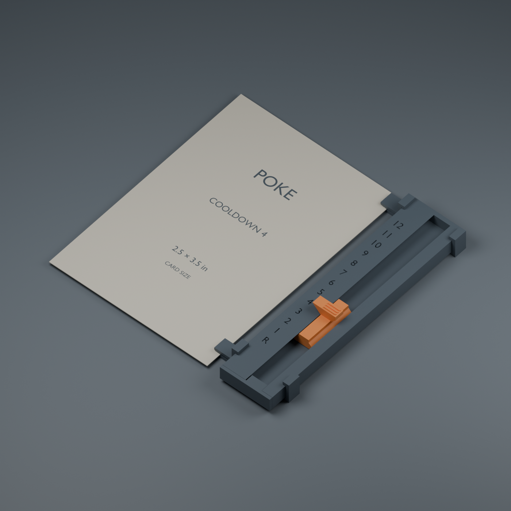

# Card-edge cooldown rail — printable prototype v1

A personal cooldown tracker for 2.5 × 3.5 inch (63.5 × 88.9 mm) cards. One
pointer selects **R (ready), 1, 2 … 12**. The rail can sit beside a card, or two
optional collars can attach it to either card edge. The numbers remain upright
on either side; do not mirror the rail itself.

## Start with the small test

Open **01-test-fit.3mf** in Bambu Studio as geometry/import models. It contains a
35.2 mm test rail and two alternative sliders, already oriented for printing.
These are model-only 3MF files: select your A1 mini, actual filament, and settings
below. They do not contain printer control commands or a saved filament setup.

The two slider parts have the same 0.8 mm spring thickness. The standard pawl
deflects about 0.40 mm between stops; the gentle version about 0.30 mm. They have
the same sliding shoe, so the gentle slider changes the click, not a tight fit
between shoe and channel. Test one at a time. In Bambu Studio the object names
identify them; mark the gentle slider underneath after printing.

1. Remove any brim, strings, or raised first-layer edges from sliding surfaces.
2. With the numbers facing up, feed a slider into the open end near R. The long
   tail points toward R; the small rounded spring bump faces the unnumbered wall.
3. Move the pointer between R, 1, and 2. Try both sliders. The test rail has no
   installed end stop, so the slider can come back out for comparison.
4. A useful fit moves with light finger pressure and settles at each number.
   If the shoe binds, stop and inspect for debris or first-layer flare. Do not
   force the thin spring. If both shoes bind, adjust clearance and reprint the
   test rather than scaling either part.

The test set is about **21 minutes / 3.7 g** in the local Bambu Studio validation
using the PLA settings below. Treat estimates as approximate, excluding any
additional real-printer setup or calibration time.

## Print one complete tracker

**02-full-tracker.3mf** contains one full rail, the standard slider, an end stop,
and two 0.50 mm nominal-gap clips with the card on the rail's left. This places
the tracker on the **right edge of the card**, as shown in the render. Use the
separate STL files for another slider or clip configuration.

| Setting | Starting value |
|---|---|
| Printer / nozzle | Bambu A1 mini / 0.4 mm |
| Material | Plain PLA for the initial test; PETG is a later option for flexing parts |
| Layer height / initial layer | 0.16 mm / 0.20 mm |
| Walls / infill | 3 walls / 20% |
| Wall generator | Arachne |
| Supports | Off; retain supplied orientations |
| Brim | Off initially; remove completely if you need one for adhesion |
| Elephant-foot compensation | 0.15 mm starting value |
| Outer / inner wall speed | 50 / 80 mm/s |
| First-layer speed | 25 mm/s |
| Scale | 100%, millimetres |

Use the temperatures and cooling appropriate to your actual filament. PETG
changes both fit and click feel: rerun the test if changing material. Avoid
scaling the whole model to tune the fit; that also changes the number spacing
and clip dimensions. The numbered faces are engraved 0.45 mm deep. A contrasting
paint fill or fine paint marker can improve readability without multi-color
printing. Keep paint out of the track.

## Assembly

1. If using clips, slide two collars over the open R end of the **empty rail**.
   Their small external jaws face the card. Park them on the unnumbered margins:
   approximately 6–11 mm from the open end, and 83–88 mm from the open end.
2. Insert your preferred slider as in the test. Slide it up into the numbered
   section. The pointer aligns with the engraved number, not the end of its tail.
3. Insert the end stop's short keyed tongue into the open R end. Its flange
   should butt against the rail end. **The stop is a clearance-fit glue-in part,
   not a snap latch.** For a reversible first assembly, retain it with a short
   strip of tape across the underside joint. Once satisfied, a tiny dab of
   suitable plastic adhesive at the stop/rail joint makes it permanent. Keep
   adhesive away from the moving shoe. The slider is captive once this stop is
   secured. Permanent adhesive also makes future slider replacement harder.
4. If attaching to a card, gently ease its edge under the two external jaws.
   Each jaw overlaps only a narrow strip of the border. Check on a spare card
   first; choose a wider slot if the fit presses hard or marks it.
5. Set the pointer to the cooldown after use; move it one click toward R at the
   chosen round boundary. R is available. No loose counters are needed.

## Choosing clips

The filenames describe **which side of the rail the card sits on**, as seen
from above with the numbers upright:

| Card position | Tracker position | Clip filename suffix |
|---|---|---|
| Left of rail | Right edge of card | `left` |
| Right of rail | Left edge of card | `right` |

Print **two identical clips** for one tracker. The rail and slider are shared.
Nominal gaps are **0.50 mm** for initial bare-card testing and **0.85 mm** for
thicker/sleeved-card testing. A rounded gripping rib reduces the local resting
gap by 0.30 mm; the jaw flexes to accept the card. These names are starting
points, not measured fits for your cardstock. Your card/sleeve thickness was
not supplied. The 0.50 mm version has about 0.20 mm at its contact rib; the
0.85 mm version has about 0.55 mm. A thin card may be loose in the wider clip.

The clips print on their 5 mm-wide end face so both slots are formed in the
print-bed plane. **Do not auto-orient them to their long underside.** That
would put roofs over the slots. The stop prints with its full flange on the
bed and its short tongue upward. The rail and slider print flat as supplied.

## Dimensions and mechanism

- Rail body: **88.9 × 20 × 5.2 mm**.
- Overall length with end stop: **90.1 mm** (0.6 mm overhang at each end if centered).
- Slider: **18.5 mm long**, 12 mm maximum width, 7.5 mm printed height.
- Slider's assembled top: **9 mm above the rail bottom**.
- With clips, bottom-to-top envelope is about **10.4 mm**.
- Stop centers: 16 mm from open end, then **5.1 mm pitch**, 13 positions.
- Approximately 0.3 mm running clearance in the lower race and 0.3 mm under the shoe.
- A wide shoe sits below two 45° retaining lips. The thumb and pointer project
  through the top opening. A planar spring along one side carries a rounded pawl
  that flexes into the 13 recessed pockets. It can move in both directions.

## Verification and limits

This is a **physically untested prototype**, not a proven print-in-one-go design.
The manufacturing meshes, not a separate illustration, generated the preview.

- All nine exported STL parts have one connected solid, positive volume, and
  zero nonmanifold edges.
- Solid intersection checks found no interference at all 13 resting positions.
- A 21-position travel check with an approximately deflected spring found no
  geometric interference over one complete repeating pitch.
- The installed end stop clears the slider at R.
- Bambu Studio slicing results are saved in `validation/slicing-summary.json`.
- The travel check is a geometric envelope check, **not** a force, fatigue,
  material, or tolerance simulation. Printed spring life, click force, clip
  grip, and bump resistance remain to be tested.

The full print, including two clips, is estimated at about **37 minutes / 7.8 g
of PLA** with these settings. Both test and full sets sliced successfully with
no warnings and supports disabled. The precise local slicing estimate is
recorded in the validation summary. No printing job has been sent to a printer.

## Editable source

`cooldown-rail.blend` contains the manufacturing objects, laid-out print copies,
and assembled preview. `build.py` regenerates the STLs, both model-only 3MFs,
mesh/clearance reports, editable Blender scene, and rendered image using Blender
without additional packages. Dimensions are in millimetres.

Change `PITCH`, `FIRST`, `LENGTH`, or the functions `rail`, `slider`, and `clip`
to alter the geometry; keep the minimum end clearance for the 18.5 mm shoe.
`validate_slicing.py` resolves the installed A1 mini profiles and slices the
models locally. It removes generated G-code, leaving the reports. Neither
script communicates with a printer.

Design references: [Bambu A1 mini quick-start specifications](https://cdn1.bambulab.com/documentation/quick-start-f507128172bdf/Quick%20start%20guide%20-%20A1%20mini-EN.pdf)
and [Prusa's guidance on printable geometry, orientation and tolerances](https://help.prusa3d.com/article/modeling-with-3d-printing-in-mind_164135).
These support general print constraints; they do not validate this mechanism.
