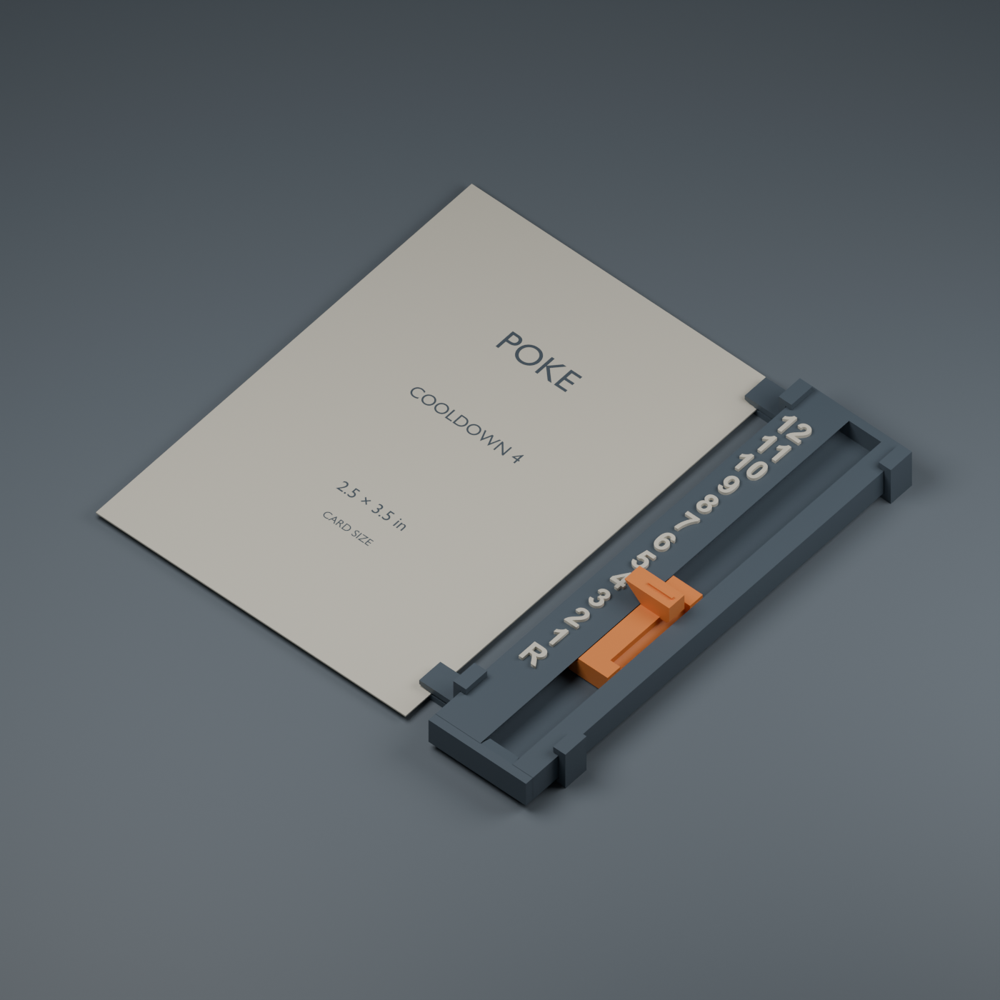

# Cooldown rail V2 — A1 mini / 0.4 mm nozzle

Start with **01-test-fit.3mf** in this folder. Open it as a project in Bambu
Studio, so its printer, process and color assignments load with the models.
The previous version remains in the parent folder.

This revision responds to the first physical print: indistinct recessed
lettering, weak detent engagement and a delicate spring. The new parts have
passed geometry and slicing checks; their physical fit and click feel still
need this next test print.

## What's changed

- **Guides at both ends of the slider** limit sideways movement independently
  of the spring. Nominal lateral clearance is 0.30 mm per side.
- **More positive engagement:** even at the furthest permitted leftward
  displacement, the rounded pawl still extends 0.40 mm into the wall between
  pockets. It must flex to pass a stop. The old design had very little margin
  against sideways movement and printing variation.
- **A longer, thicker free spring:** 1.20 mm for the standard slider; 1.05 mm
  for the lighter alternative, compared with 0.80 mm previously. Both have
  the same guide fit and pawl shape. A rounded root supports the beam.
- **Bold raised lettering**, physically 3.8 mm tall and 0.6 mm above the
  surface. The numerals are a separate, aligned part assigned to filament 2.
- **The cap is on the test plate.** Its short tapered key now has an
  easy-entry tip and a slight interference at its shoulder for a press fit.
  This replaces the old clearance-fit glue-in cap. Snugness needs testing.
- The opposite end remains closed. Full rail body dimensions remain
  **20 × 88.9 × 5.2 mm**, or 5.8 mm tall over the numerals.

## Printer and colors

Both projects have these settings saved and have been reopened and sliced
using Bambu Studio's local command-line interface:

| Setting | Saved value |
|---|---|
| Printer | Bambu Lab A1 mini, 0.4 mm nozzle |
| Process basis | 0.20mm Standard @BBL A1M, with the adjustments below |
| Layer height / first layer | 0.20 / 0.20 mm |
| Walls / infill | 3 / 20% |
| Wall generator | Arachne |
| Outer / inner wall speed | 50 / 80 mm/s |
| Initial layer speed | 25 mm/s |
| Elephant-foot compensation | 0.15 mm |
| Supports / brim | Off / off |
| Plate | Textured PEI Plate |
| Filament placeholders | Bambu PLA Basic for both colors |

**The 0.4 mm nozzle and 0.20 mm process are different measurements.** The first
describes the opening in your physical nozzle. The second is the height of
each printed layer. Your choice of those two settings was reasonable; changing
them did not edit or damage the model. The old geometry-only file did not save
the intended printer profile.

Filament **1** is the rail, sliders and cap; filament **2** is **Raised
numerals**. The project uses orange and white as placeholders. Choose the
profiles for your actual PLA and map the two colors to your AMS Lite spools
when printing. If your plate differs, select your actual plate as well.
Colors can be changed without painting individual faces. For a single-color
test, assign the Raised numerals part to filament 1 and re-slice.

Keep the supplied orientations and 100% scale. The rail and sliders lie flat;
the cap's broad flange sits on the bed. Do not enable automatic orientation.

The two-color test slices to approximately **34 minutes / 8.3 g**, including
estimated purge and prime-tower material. The full tracker is approximately
**42 minutes / 11.0 g**. Real time depends on calibration, filament choices
and printer setup. The projects are unsliced; slice again before printing.

## Test assembly

The 48.4 mm test rail has five sample positions: **R, 1, 2, 10, 12**. The jumps
are intentional: they test both mechanical clicks and double-digit legibility
without printing the full rail. The full tracker has every value R–12.

1. Let the parts cool and remove any strings or first-layer burrs from the
   sliding surfaces.
2. Start with the **standard slider: one raised grip rib**. The lighter
   alternative has **two ribs**. Try one at a time.
3. Feed the slider into the open end near R, with its long tail pointing
   toward that opening and its rounded spring bump facing the unnumbered wall.
4. Before adding the cap, move through the positions. At a middle position,
   tilt the rail vertically: the detent should hold it there under its own
   weight. The cap prevents escape; it should not be needed to hold a number.
5. Press the cap's keyed tongue into the open end with its flat underside
   aligned to the rail underside. Its flange should seat against the end
   with a snug fit. Do not glue it during this test. If it requires substantial
   force, stop short rather than damaging the rail; if loose, note that for
   the next fit adjustment.
6. Check that R is reachable with the cap installed, and that the cap stays
   seated when the slider reaches the end. Pull on the cap flange to remove it
   for the other slider trial.

A good result is legible numbers, a distinct stop at each position and
comfortable movement in both directions. Try repeated round trips to check
for sticking or loss of engagement. Physical tests establish click force,
sound and durability; the computer checks cannot establish those.

## Full tracker and optional card clips

**02-full-tracker.3mf** contains the full rail, standard slider, cap and two
bare-card clips for mounting the tracker on the card's right edge. Insert the
clips over the empty rail before installing the slider and cap. Park the clips
near the ends, approximately 6–11 mm and 83–88 mm from the open end, leaving
the numbers visible. Then assemble the slider and cap as above.

The STL folder also includes left/right clip arrangements and wider slots.
Their filenames describe the **side of the rail occupied by the card**:
`left` puts the tracker on the card's right edge, and vice versa. Print two
matching clips. The 0.50 and 0.85 mm names are nominal slot dimensions; a
rounded contact rib reduces the local gap by 0.30 mm. Check on a spare card.
These optional clip dimensions are carried over from V1 and remain physically
unverified for your particular cardstock or sleeves.

Use the V2 rail and V2 sliders together. The cap, spring geometry and first
number location have changed; do not use the old test to judge the new slider.

For STL-only workflows, `rail-one-color.stl` and `test-rail-one-color.stl`
include the raised numbers as a single solid. The separate `*-body.stl` and
`*-numerals.stl` files share coordinates: import each pair as **parts of one
object**, preserving alignment. Do not independently drop the numerals onto
the bed. The prepared 3MF projects handle this for you.

## Validation and editable source

Every exported mesh is closed and manifold, with a positive volume. Each
physical part is connected; the colorable lettering consists of separate
glyphs that join the rail during printing. Combined single-color rails were
also checked as connected solids.

Geometry checks cover 156 resting poses, including lateral extremes and the
slider resting on the channel floor; 252 travel poses with an approximate
deflected spring; interference at the unflexed pawl between stops; and cap
clearance at R. These are geometric envelope checks, not stress or fatigue
simulation. The tapered cap intentionally has local press interference.

Both final projects slice on one A1 mini plate at 0.20 mm with two filaments
and no reported slicing warnings. Reports are in `validation/`. Actual
numeral appearance and mechanical performance remain dependent on the print.

`build.py` and `cooldown-rail.blend` provide editable source. `validate_slicing.py`
resolves the installed Bambu profiles, creates the native projects, assigns
the numeral color and checks the saved results. Nothing was sent to a printer.
The project export/slicing workflow follows
[Bambu Studio's command-line documentation](https://github.com/bambulab/BambuStudio/wiki/Command-Line-Usage).
